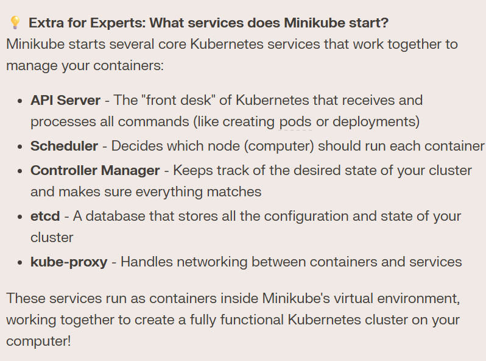
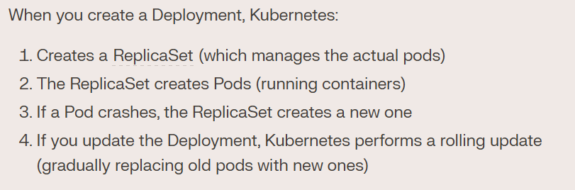
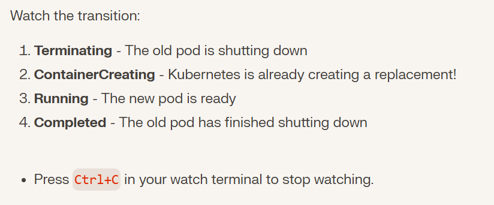
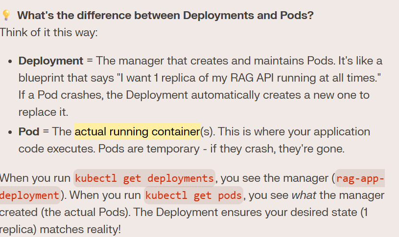
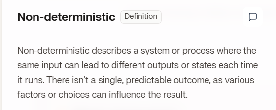
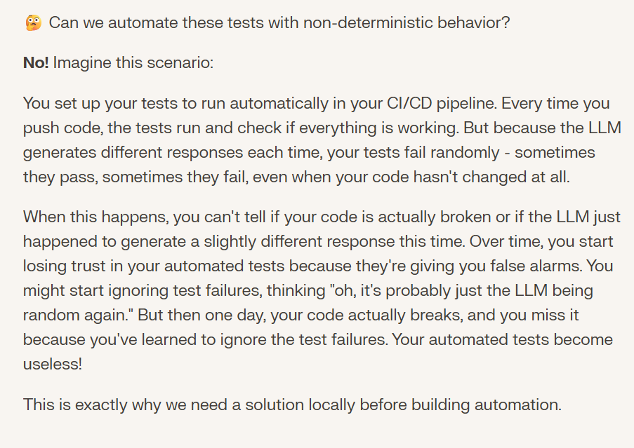
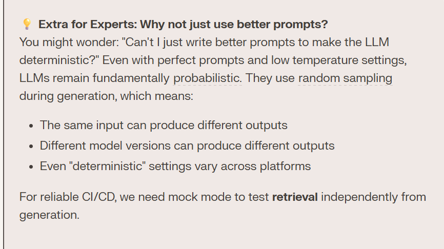

## Architecture Showing Kubernetes Deployment:

## Kubernetes Cluster through `minikube`:

- `minikube start` Starts Local Kubernetes Cluster which runs in Single Node 

- Minikube is a tool that Creates and Manages Kubernetes Cluster in the local machine
- This Minikube Creates a Kubernetes Cluster inside a Docker Container, this container or Node is named minikube
- The Node is like Building of a Company and Kubernetes Cluster is the management that is present inside the Building and Manages the company
- Soo for now in local Development, simulation would be like:
    - Minikube running inside Docker
    - This Minikube has its own Docker Engine
    - Minikube has its own Docker storage where it keeps images, completely separate from your computer's Docker Desktop
    - This means we need to Copy teh Docker image from out Docker Desktop to Docker Storage present inside the Minikube
    - `minikube image load` is used to copy the image to Docker storage inside it.

## Kubernetes Deployment:
### `deployment.yaml`
- blueprint that tells Kubernetes how to run your app. 
- Kubernetes will make sure your app always matches this blueprint - if a container crashes, Kubernetes automatically starts a new one.
    - Specifies which container image to run
    - Defines how many replicas (copies) to run
    - Handles rolling updates (updating without downtime)
    - Restarts containers if they crash
    -  Scales application up or down
### How Deployments work?  

 

## `kubectl apply -f deployment.yaml`

# Pods
## What is a Pod?

## What does pod names mean: 

## What happens when a pod is deleted in a kubernetes Cluster(Reconcillation Loop):
- The moment Kubernetes detected that a pod was deleted, it immediately started creating a replacement

### What is Reconcillation Loop?
- Kubernetes Constantly Compares:
    - Desired state (what you declared in your YAML: "I want 1 replica")
    - Actual state (what's actually running: "I have 0 replicas")
- If they don't match, Kubernetes takes action to fix it. This loop runs continuously, which is why Kubernetes can self-heal automatically
## Deployment VS Pods:

## kuberbnetes Services:

## `kubectl apply -f service.yaml`
- Think of it like this: If your node is the building, NodePort is the front door (port 30000), the Service is the receptionist who knows where to send visitors, and your Pod is the office where your API actually works!

## Non-deterministic LLM Behaviour:

- This problem is Solved by using `Mock LLM Mode`
