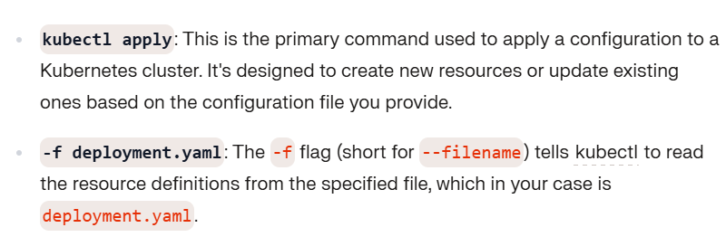
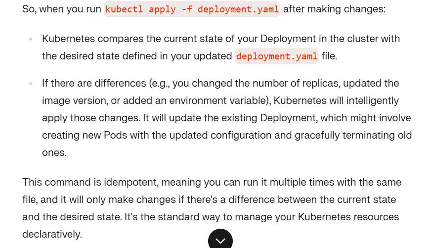
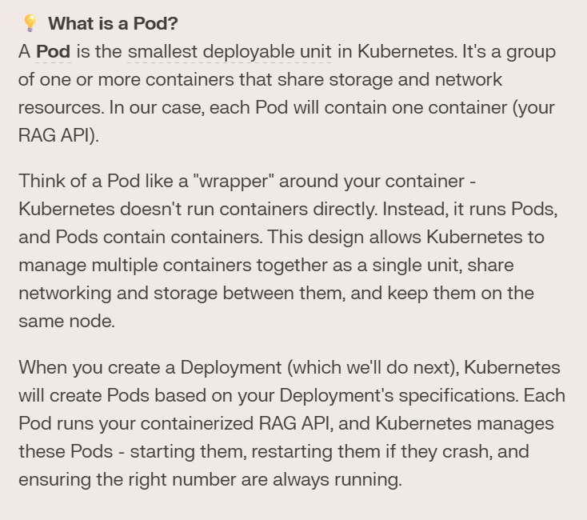
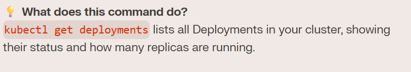
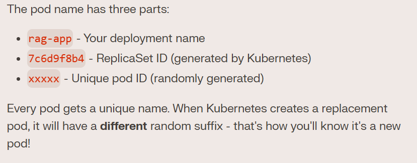
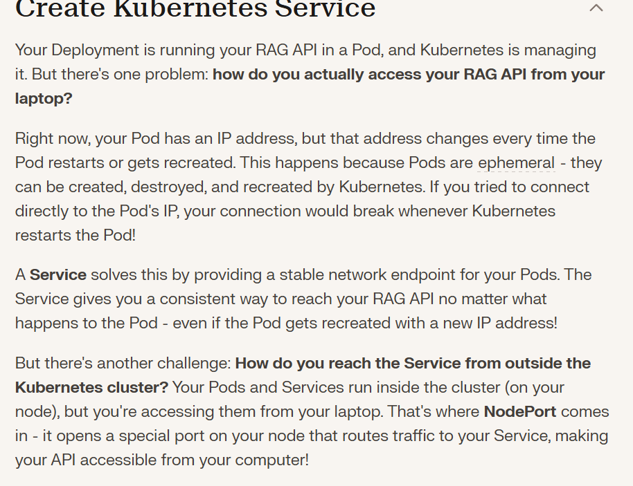
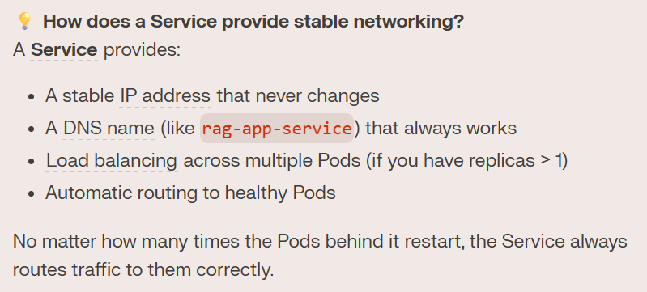

## What is a Pod?

## Deployment VS Pods:

## kuberbnetes Services:

- Think of it like this: If your node is the building, NodePort is the front door (port 30000), the Service is the receptionist who knows where to send visitors, and your Pod is the office where your API actually works!